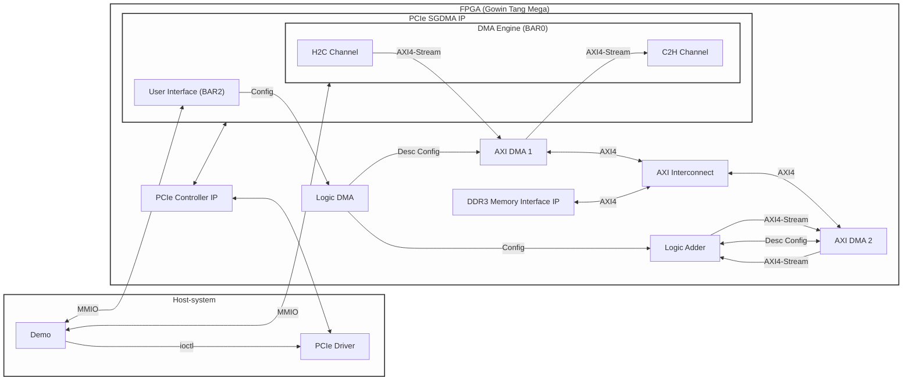

# Technical Documentation

This documentation describes the hardware-software interface for demonstration project on the Sipeed Tang Mega 138K Pro.

## Data Movement Flow

1. **Config:** Host sets write DDR3 addresses in BAR2 registers.
2. **Upload:** Host writes data to DDR3 via PCIe H2C SGDMA (managed via BAR0).
3. **Compute:** Host triggers `LAD_START`. The Logic Adder pulls data from DDR3, processes it, and writes results back to a different DDR3 region.
4. **Config:** Host sets read DDR3 addresses in BAR2 registers.
5. **Download:** Host reads results from DDR3 via PCIe C2H SGDMA.

## Architecture

* **PCIe Controller & SGDMA:** Manages the physical and protocol layers of the PCIe link. It handles TLP encoding/decoding, BAR space mapping, and provides Scatter-Gather DMA channels for data movement between Host RAM and the FPGA.
* **Logic DMA:** Translates configuration parameters from the BAR2 register space into AXI DMA descriptors. It defines the specific source and destination addresses within the DDR3 memory for both adder and Host-side data transfer.
* **AXI Interconnect:** Enables concurrent or multiplexed access, allowing the PCIe SGDMA engine and the Logic Adder to perform read/write operations within the shared DDR3 address space.
* **Logic Adder:** Utilizes AXI4-Stream interfaces for data consumption and production. The module generates read/write descriptors to fetch operands from DDR3 and commit results back to memory via the AXI DMA infrastructure.

## Registers

Detailed descriptions of the Descriptor and BAR0 register control can be found in the [Gowin PCIe SGDMA IP User Guide](https://www.gowinsemi.com/upload/database_doc/3345/document/69810ed812355.pdf).

### BAR2 Registers

The BAR2 interface provides direct memory-mapped I/O (MMIO) access to the user logic, allowing the host to configure and control the Logic DMA and the Logic Adder core.

| Offset | Name | Access | Description |
| :--- | :--- | :--- | :--- |
| 0x00 | **Control** | RW | Process start/stop control for DMA and Adder logic. |
| 0x04 | **Status** | RO | Execution status and hardware readiness flags. |
| 0x10-0x38 | **Address & Length** | RW | Source, destination, address and data length for H2C, C2H, adder transfers. |

### Register Details

**Control Register (0x00)**

| Bit Index | Access | Description |
| :--- | :--- | :--- |
| 31:6 | RO | Reserved. |
| 5 | RW | Write 1 to force stop the Logic Adder. |
| 4 | RW | Write 1 to start the Logic Adder operation. |
| 3 | RW | Write 1 to stop the C2H transfer (FPGA to Host). |
| 2 | RW | Write 1 to start the C2H transfer (FPGA to Host). |
| 1 | RW | Write 1 to stop the H2C transfer (Host to FPGA). |
| 0 | RW | Write 1 to start the H2C transfer (Host to FPGA). |

**Status Register (0x04)**

| Bit Index | Access | Description |
| :--- | :--- | :--- |
| 31:7 | RO | Reserved. |
| 6 | RO | Logic Adder done. |
| 5 | RO | Logic Adder busy. |
| 4 | RO | Logic Adder run. |
| 3 | RO | H2C descriptor ready. |
| 2 | RO | C2H descriptor ready. |
| 1 | RO | H2C descriptor valid. |
| 0 | RO | C2H descriptor valid. |

**Address and Length Registers (0x10 - 0x38)**

These registers must be configured before setting the corresponding `START` bit in the Control Register.

| Offset | Access | Description |
| :--- | :--- | :--- |
| 0x10 | RW | PCIe Write Address: Base address in local DDR3 memory for H2C transfer. |
| 0x14 | RW | PCIe Write Length: Data size in bytes for the H2C transfer. |
| 0x20 | RW | PCIe Read Address: Base address in local DDR3 memory for C2H transfer. |
| 0x24 | RW | PCIe Read Length: Data size in bytes for the C2H transfer. |
| 0x30 | RW | Logic Adder Read Address: DDR3 memory containing operands for the adder. |
| 0x34 | RW | Logic Adder Write Address: DDR3 memory where results will be stored. |
| 0x38 | RW | Logic Adder Length: Number of data elements/bytes to be processed. |
